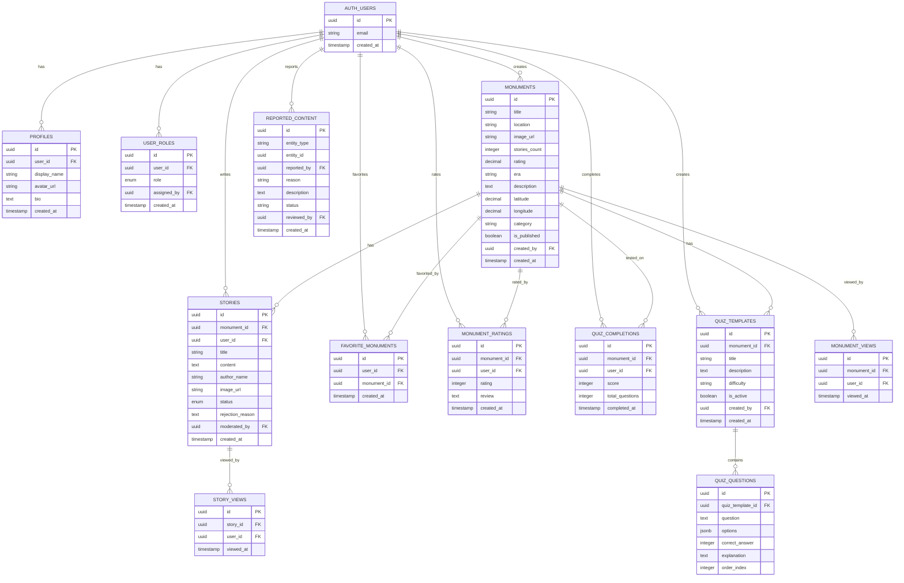

# Database Schema Diagram

## Entity Relationship Diagram (ERD)



## Table Categories

### 👤 User Management
- `profiles` - User profile information
- `user_roles` - Role-based access control
- `auth.users` - Supabase authentication (system table)

### 🏛️ Content Tables
- `monuments` - Heritage sites and monuments
- `stories` - User-contributed stories
- `quiz_templates` - Quiz definitions
- `quiz_questions` - Quiz question bank

### ⭐ User Interactions
- `favorite_monuments` - Bookmarked monuments
- `monument_ratings` - Ratings and reviews
- `quiz_completions` - Quiz results

### 📊 Analytics
- `monument_views` - Monument page views
- `story_views` - Story read tracking
- (Automatically tracked, high-volume tables)

### 🛡️ Moderation
- `reported_content` - User-reported items
- `moderation_log` - Moderation action history
- `admin_activity_log` - Admin action audit trail

## Data Flow Diagrams

### User Story Submission Flow
```
┌──────────┐
│  User    │
└────┬─────┘
     │ 1. Submit Story
     ↓
┌──────────────────┐
│ stories table    │
│ status: pending  │
└────┬─────────────┘
     │ 2. RLS allows insert
     ↓
┌──────────────────┐
│ Moderator Views  │
│ in Admin Panel   │
└────┬─────────────┘
     │ 3. Approve/Reject
     ↓
┌──────────────────┐
│ Update status    │
│ + moderated_by   │
└────┬─────────────┘
     │ 4. Trigger fires
     ↓
┌──────────────────┐
│ Update monument  │
│ stories_count    │
└──────────────────┘
```

### Monument Rating Flow
```
┌──────────┐
│  User    │
└────┬─────┘
     │ 1. Rate Monument (1-5 stars)
     ↓
┌───────────────────────┐
│ monument_ratings      │
│ UNIQUE(user, monument)│
└────┬──────────────────┘
     │ 2. Trigger on INSERT/UPDATE/DELETE
     ↓
┌───────────────────────┐
│ calculate_avg_rating()│
│ function executes     │
└────┬──────────────────┘
     │ 3. Update aggregate
     ↓
┌───────────────────────┐
│ monuments.rating      │
│ = AVG(all ratings)    │
└───────────────────────┘
```

### Admin Panel Access Control
```
┌──────────┐
│  User    │
└────┬─────┘
     │ 1. Navigate to /admin
     ↓
┌──────────────────┐
│ useUserRole()    │
│ hook checks role │
└────┬─────────────┘
     │ 2. Query user_roles
     ↓
┌──────────────────┐
│ has_role()       │
│ function called  │
└────┬─────────────┘
     │ 3. Check result
     ├─ Yes → Allow access
     └─ No  → Redirect to home
```

## Access Patterns by Role

### 👑 Admin
```sql
-- Can do everything
monuments:         SELECT, INSERT, UPDATE, DELETE
stories:           SELECT, INSERT, UPDATE, DELETE
user_roles:        SELECT, INSERT, UPDATE, DELETE
quiz_templates:    SELECT, INSERT, UPDATE, DELETE
quiz_questions:    SELECT, INSERT, UPDATE, DELETE
reported_content:  SELECT, UPDATE
moderation_log:    SELECT, INSERT
admin_activity_log: SELECT, INSERT
```

### 🛡️ Moderator
```sql
-- Limited management
stories:           SELECT (all), UPDATE (status only)
monuments:         SELECT
reported_content:  SELECT, UPDATE
moderation_log:    SELECT, INSERT
-- + All regular user permissions
```

### 👤 User
```sql
-- Own data only
profiles:          SELECT (own), UPDATE (own)
stories:           SELECT (approved), INSERT (own), UPDATE (own+pending)
favorite_monuments: SELECT (own), INSERT, DELETE
monument_ratings:  SELECT (all), INSERT (own), UPDATE (own)
quiz_completions:  INSERT (own), SELECT (own)
monuments:         SELECT (published only)
```

## Storage Buckets Structure

```
supabase-storage/
├── avatars/
│   └── {user_id}/
│       └── avatar.jpg (max 5MB)
│
├── story-images/
│   └── {user_id}/
│       ├── story1.jpg
│       ├── story2.png
│       └── ... (max 10MB each)
│
└── monument-images/
    └── monuments/
        ├── monument1.jpg
        ├── monument2.webp
        └── ... (max 10MB each, admin only)
```

## Indexes for Performance

### Primary Indexes (auto-created)
- All `id` columns (PRIMARY KEY)
- All `user_id` references
- `(user_id, monument_id)` in favorite_monuments
- `(user_id, role)` in user_roles

### Custom Indexes (created by migration)
```sql
-- Monuments
idx_monuments_created_at       (created_at DESC)
idx_monuments_rating          (rating DESC)
idx_monuments_era             (era)
idx_monuments_location        (location)
idx_monuments_is_published    (is_published)

-- Stories
idx_stories_monument_id       (monument_id)
idx_stories_status            (status)
idx_stories_created_at        (created_at DESC)

-- Analytics
idx_story_views_story_id      (story_id)
idx_story_views_viewed_at     (viewed_at)
idx_monument_views_monument_id (monument_id)
idx_quiz_completions_user_id  (user_id)

-- Moderation
idx_moderation_log_entity     (entity_type, entity_id)
idx_reported_content_status   (status)
```

## Function Call Graph

```
┌──────────────────────────────┐
│ Application Layer            │
└──────────────────────────────┘
               │
    ┌──────────┼──────────┐
    │          │          │
    ↓          ↓          ↓
┌────────┐ ┌────────┐ ┌───────────┐
│has_role│ │is_admin│ │handle_new │
│        │ │_or_mod │ │_user      │
└───┬────┘ └───┬────┘ └─────┬─────┘
    │          │            │
    ↓          ↓            ↓
┌────────────────────────────────┐
│ RLS Policies                   │
├────────────────────────────────┤
│ • Check user permissions       │
│ • Filter visible rows          │
│ • Enforce data access rules    │
└────────────────────────────────┘
```

## Trigger Execution Flow

```
INSERT/UPDATE/DELETE on tables
         ↓
┌────────────────────────┐
│ BEFORE Triggers        │
├────────────────────────┤
│ • update_updated_at    │ ← Sets updated_at = now()
└────────────────────────┘
         ↓
┌────────────────────────┐
│ Execute Operation      │
└────────────────────────┘
         ↓
┌────────────────────────┐
│ AFTER Triggers         │
├────────────────────────┤
│ • on_rating_change     │ ← Recalculate avg rating
│ • on_story_status      │ ← Update stories_count
│ • on_auth_user_created │ ← Create profile
└────────────────────────┘
```

## Cascading Delete Behavior

```
DELETE auth.users (id = X)
    ↓ CASCADE
    ├─→ DELETE profiles (user_id = X)
    ├─→ DELETE user_roles (user_id = X)
    ├─→ DELETE stories (user_id = X)
    ├─→ DELETE favorite_monuments (user_id = X)
    └─→ DELETE monument_ratings (user_id = X)

DELETE monuments (id = Y)
    ↓ CASCADE
    ├─→ DELETE stories (monument_id = Y)
    ├─→ DELETE favorite_monuments (monument_id = Y)
    ├─→ DELETE monument_ratings (monument_id = Y)
    ├─→ DELETE monument_views (monument_id = Y)
    ├─→ DELETE quiz_templates (monument_id = Y)
    │       ↓ CASCADE
    │       └─→ DELETE quiz_questions
    └─→ DELETE quiz_completions (monument_id = Y)
```

---

**Note**: This diagram represents the complete schema from `20251228000000_complete_migration.sql`
